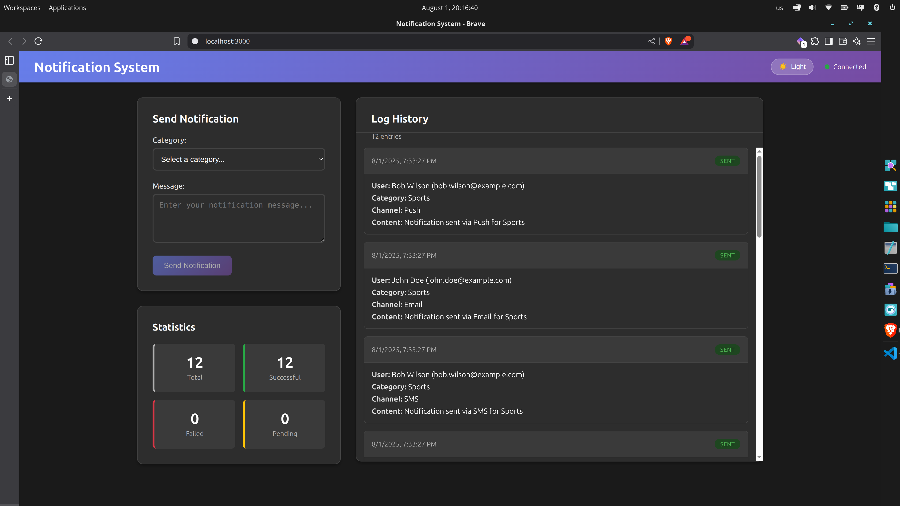

# Notification System

A full-stack notification delivery system built with Clojure/ClojureScript that handles message categorization, user subscriptions, and multi-channel notification delivery.

## Overview

This system allows sending notifications to users based on their category subscriptions and preferred delivery channels. It implements a robust architecture with proper separation of concerns, comprehensive testing, and scalable design patterns.



### Key Features

- **Multi-Channel Delivery**: SMS, Email, and Push Notifications
- **Category-Based Subscriptions**: Sports, Finance, and Movies
- **Real-time Interface**: Live notification log updates
- **Robust Architecture**: Strategy pattern for channel selection
- **Comprehensive Logging**: Full audit trail of all notifications
- **Database Persistence**: PostgreSQL with proper migrations
- **Full-Stack**: ClojureScript frontend with Reagent/Re-frame

### Prerequisites

- Java 17+
- Clojure CLI tools
- Docker and Docker Compose
- Node.js (for frontend dependencies)

### 1. Start the Database

```bash
# Start PostgreSQL container
docker-compose up -d postgres

# Verify database is running
docker-compose ps
```

### 2. Install Dependencies

```bash
# Install Clojure dependencies
clj -P -M:dev:test:build

# Install Node.js dependencies
npm install
```

### 3. Run the Application

#### Production Mode (Recommended for Demo)
```bash
# Build optimized frontend
clj -M:build

# Start the server
clj -M:web

# Access the application at: http://localhost:3000
```

#### Development Mode (Hot Reload)
```bash
# Terminal 1: Start backend server
clj -M:dev

# Terminal 2: Start frontend development server
clj -M:frontend

# Access at: http://localhost:3001 (with hot reload)
```

## System Architecture

### Design Patterns Implemented

1. **Strategy Pattern**: For notification channel selection and delivery
2. **Repository Pattern**: For data access abstraction
3. **Factory Pattern**: For notification channel creation
4. **Observer Pattern**: For real-time UI updates

### Project Structure

```
src/
├── clj/notify_system/          # Backend (Clojure)
│   ├── main.clj               # Application entry point
│   ├── web.clj                # Web server and routing
│   ├── service.clj            # Business logic layer
│   ├── channels.clj           # Notification channels (Strategy pattern)
│   ├── db.clj                 # Database layer (Repository pattern)
│   ├── users.clj              # User management
│   └── logging.clj            # Logging system
└── cljs/notify_system/         # Frontend (ClojureScript)
    ├── frontend.cljs          # Main frontend entry point
    └── frontend/              # Frontend modules
        ├── core.cljs          # Core app logic
        ├── components.cljs    # UI components
        ├── events.cljs        # Re-frame events
        ├── state.cljs         # Application state
        ├── api.cljs           # API client
        ├── websocket.cljs     # WebSocket handling
        ├── theme.cljs         # UI theming
        └── utils.cljs         # Utility functions
```

### Database Schema

- **users**: User profiles with contact information
- **user_subscriptions**: Category subscriptions per user
- **user_channels**: Preferred notification channels per user
- **notifications**: Message storage
- **notification_logs**: Delivery audit trail

## Using the Application

### 1. Message Submission Form

- **Category**: Select from Sports, Finance, or Movies
- **Message**: Enter your notification text (required)
- Click "Send Notification" to deliver to all subscribed users

### 2. Notification Log

- Real-time display of all sent notifications
- Shows timestamp, category, message, recipient, and delivery status
- Sorted from newest to oldest
- Updates automatically when new notifications are sent

### 3. Pre-configured Test Users

The system includes mock users with different subscription preferences:

- **Alice Johnson**: Sports + Finance → SMS + Email
- **Bob Smith**: All categories → Email + Push
- **Carol Davis**: Movies + Finance → SMS + Push
- **David Wilson**: Sports only → All channels

## Testing

### Run All Tests
```bash
clj -M:test
```

### Run Tests with File Watching
```bash
clj -M:test-watch
```

### Test Coverage

- **Unit Tests**: All service functions and business logic
- **Integration Tests**: Database operations and API endpoints
- **System Tests**: End-to-end notification delivery
- **Regression Tests**: Logging system reliability

## Development

### REPL Development
```bash
# Start REPL
clj -M:repl

# In REPL, start the system
(require '[notify-system.main :as main])
(main/-main)
```

### Database Management

```bash
# Reset database with fresh seed data
clj -M:dev -e "(require '[notify-system.db :as db]) (db/init-and-seed!)"

# Run specific migrations
clj -M:dev -e "(require '[migratus.core :as migratus]) (migratus/migrate {:store :database :migration-dir \"migrations/\" :db db-spec})"
```

### API Endpoints

- `GET /api/users` - List all users with subscriptions
- `POST /api/notifications` - Send new notification
- `GET /api/notifications/log` - Retrieve notification history
- `GET /health` - System health check
- `GET /metrics` - Application metrics

## Architecture Highlights

### SOLID Principles Implementation

- **Single Responsibility**: Each namespace has a clear, focused purpose
- **Open/Closed**: Easy to add new notification channels without modifying existing code
- **Liskov Substitution**: All notification channels implement the same interface
- **Interface Segregation**: Clean separation between data access, business logic, and presentation
- **Dependency Inversion**: High-level modules don't depend on low-level modules

### Scalability Features

- **Pluggable Channels**: Add new notification types by implementing the channel protocol
- **Database Indexing**: Optimized queries for user lookups and log retrieval
- **Async Processing**: Core.async for non-blocking notification delivery
- **Stateless Design**: Easy horizontal scaling
- **Configuration-Driven**: Environment-based configuration for different deployments

## Performance & Monitoring

### Health Checks
- Database connectivity
- System uptime
- Memory usage
- Active connections

### Logging
- Structured logging with timestamps
- Request/response logging
- Error tracking and alerting
- Performance metrics

## Production Deployment

### Docker Production Build
```bash
# Build and start production environment
docker-compose -f docker-compose.prod.yml up -d

# Access at configured domain with Nginx reverse proxy
```


---

*Built by Patrick Serrano with ❤️ using Clojure, ClojureScript, PostgreSQL, and modern web technologies*